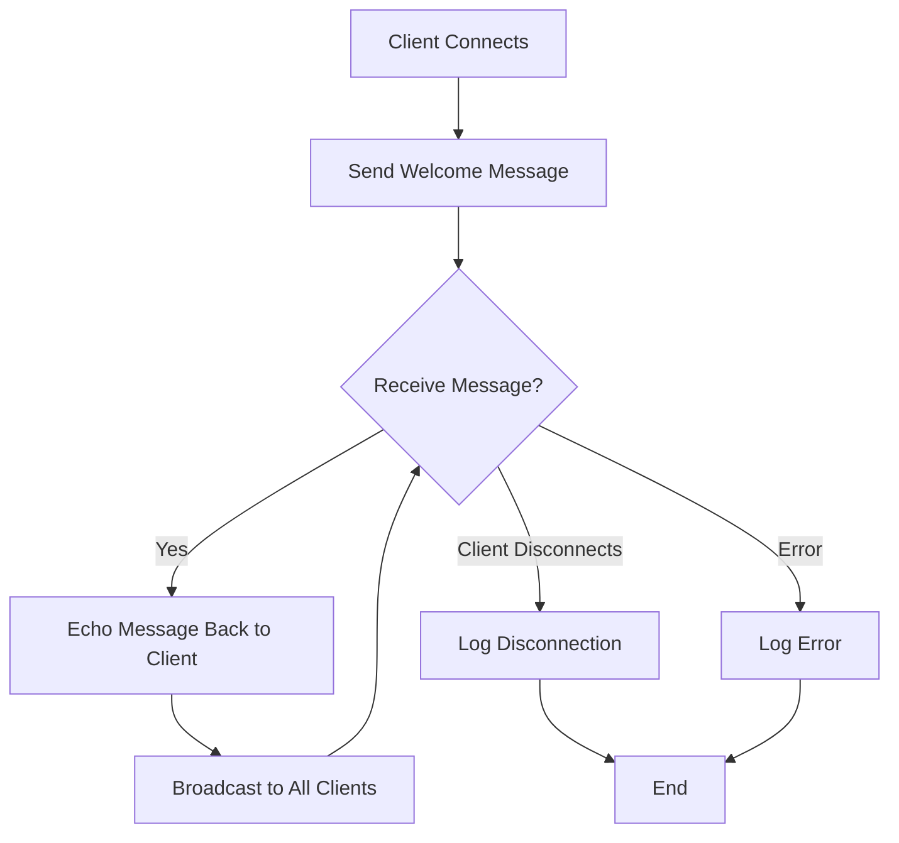

# Multi Node WebSocket Server

A simple Node.js WebSocket server using the `ws` library.

## Features

- Accepts WebSocket connections on `ws://localhost:8080`
- Echoes messages back to the client
- Broadcasts messages to all connected clients
- Handles client connections, disconnections, and errors

## Installation

```bash
npm install
```

## Running the Server

```bash
npm start
```

The server will start listening on `ws://localhost:8080`

## Testing

You can test the WebSocket server using a WebSocket client. Here's a simple HTML/JavaScript client example:

```html
<!DOCTYPE html>
<html>
<head>
    <title>WebSocket Client</title>
</head>
<body>
    <h1>WebSocket Client</h1>
    <input type="text" id="messageInput" placeholder="Enter a message">
    <button onclick="sendMessage()">Send</button>
    <div id="messages"></div>

    <script>
        const ws = new WebSocket('ws://localhost:8080');

        ws.onopen = () => {
            console.log('Connected to server');
        };

        ws.onmessage = (event) => {
            const messagesDiv = document.getElementById('messages');
            messagesDiv.innerHTML += '<p>' + event.data + '</p>';
        };

        ws.onclose = () => {
            console.log('Disconnected from server');
        };

        function sendMessage() {
            const input = document.getElementById('messageInput');
            ws.send(input.value);
            input.value = '';
        }
    </script>
</body>
</html>
```

## Server Flow Diagram



## Server Behavior

- When a client connects, they receive a welcome message
- Any message sent by a client is echoed back to that client
- All messages are also broadcast to all other connected clients
- The server logs all connections, disconnections, and messages to the console
