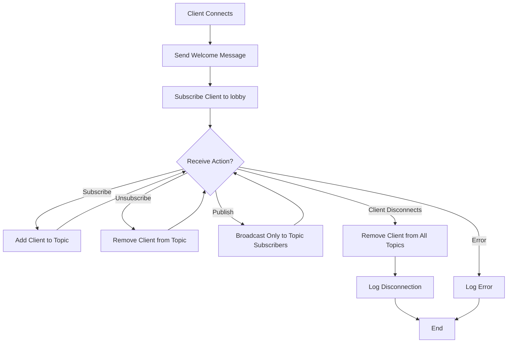
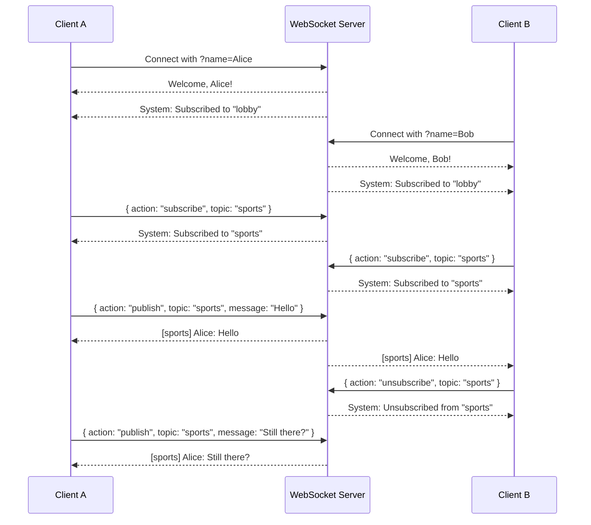

# Multi Node WebSocket Server

A simple Node.js WebSocket server using the `ws` library.

## Features

- Accepts WebSocket connections on `ws://localhost:8080`
- Automatically subscribes each client to the `lobby` topic
- Supports topic subscriptions and unsubscriptions
- Publishes messages only to clients subscribed to the same topic
- Handles client connections, disconnections, and errors

## Message Protocol

Clients can continue sending plain text messages, which will be published to the default `lobby` topic.

For room-based behavior, send JSON messages with one of these actions:

```json
{ "action": "subscribe", "topic": "sports" }
{ "action": "unsubscribe", "topic": "sports" }
{ "action": "publish", "topic": "sports", "message": "Hello room" }
{ "action": "list" }
```

## Installation

```bash
npm install
```

## Running the Server

```bash
npm start
```

The server will start listening on `ws://localhost:8080`

## Testing

You can test the WebSocket server using the browser client in the project root or any WebSocket client that can send JSON payloads.

Browser flow:

- Join with a name
- Subscribe to a topic such as `sports`
- Open a second browser tab, join with another name, and subscribe to the same topic
- Send a message to that topic and only subscribers to that topic will receive it
- Unsubscribe from the topic and verify new messages stop arriving

Minimal JavaScript example:

```html
<!DOCTYPE html>
<html>
<head>
    <title>WebSocket Client</title>
</head>
<body>
    <h1>WebSocket Client</h1>
    <input type="text" id="topicInput" value="lobby" placeholder="Topic">
    <input type="text" id="messageInput" placeholder="Enter a message">
    <button onclick="subscribe()">Subscribe</button>
    <button onclick="unsubscribe()">Unsubscribe</button>
    <button onclick="sendMessage()">Publish</button>
    <div id="messages"></div>

    <script>
        const ws = new WebSocket('ws://localhost:8080?name=BrowserClient');

        ws.onopen = () => {
            console.log('Connected to server');
        };

        ws.onmessage = (event) => {
            const messagesDiv = document.getElementById('messages');
            messagesDiv.innerHTML += '<p>' + event.data + '</p>';
        };

        ws.onclose = () => {
            console.log('Disconnected from server');
        };

        function subscribe() {
            const topic = document.getElementById('topicInput').value.trim();
            ws.send(JSON.stringify({ action: 'subscribe', topic }));
        }

        function unsubscribe() {
            const topic = document.getElementById('topicInput').value.trim();
            ws.send(JSON.stringify({ action: 'unsubscribe', topic }));
        }

        function sendMessage() {
            const input = document.getElementById('messageInput');
            const topic = document.getElementById('topicInput').value.trim();
            ws.send(JSON.stringify({ action: 'publish', topic, message: input.value }));
            input.value = '';
        }
    </script>
</body>
</html>
```

## Server Flow Diagram



## Example Topic Flow

This example shows two clients, one topic named `sports`, and the server-side objects that change during the flow.



## What Is Stored Where

The server stores topic membership in two places so it can answer both questions efficiently: which topics a client has joined, and which clients belong to a topic.

- `topicSubscribers` is a `Map` stored at server level.
- Key: topic name such as `lobby` or `sports`.
- Value: a `Set` of WebSocket client objects subscribed to that topic.
- `ws.userName` is stored on each client connection object.
- `ws.subscriptions` is a `Set` stored on each client connection object.
- `ws.subscriptions` contains topic names for that one client.

Example state after Alice and Bob both subscribe to `sports`:

```js
topicSubscribers = {
    lobby: Set(wsAlice, wsBob),
    sports: Set(wsAlice, wsBob)
}

wsAlice = {
    userName: 'Alice',
    subscriptions: Set('lobby', 'sports')
}

wsBob = {
    userName: 'Bob',
    subscriptions: Set('lobby', 'sports')
}
```

When Alice publishes to `sports`, the server:

1. Checks `wsAlice.subscriptions` to confirm Alice is allowed to publish there.
2. Reads `topicSubscribers.get('sports')` to find all subscribed clients.
3. Sends the formatted message to every open WebSocket in that set.

## Server Behavior

- When a client connects, they receive a welcome message and are subscribed to `lobby`
- Clients can subscribe to additional topics or unsubscribe from them at runtime
- Messages are published only to the selected topic and only delivered to subscribers of that topic
- Plain text messages are treated as messages to the default `lobby` topic
- The server logs all connections, disconnections, and messages to the console
